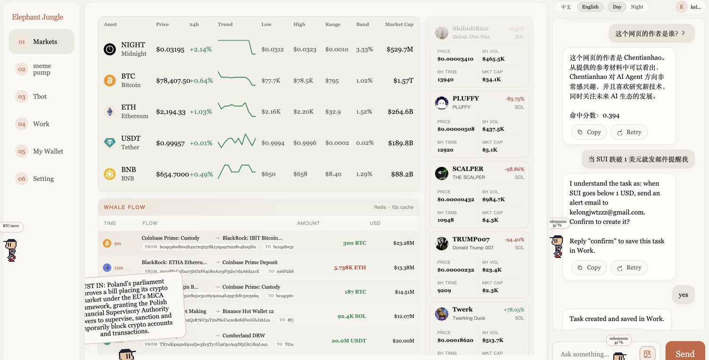
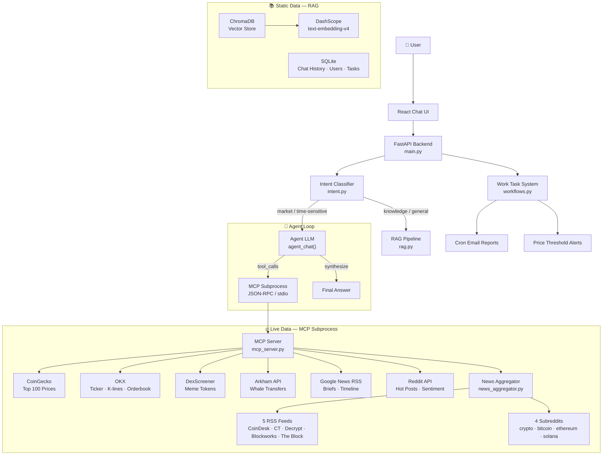
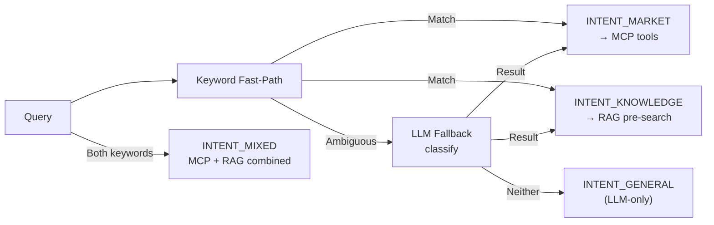

# Elephant Jungle 🐘🌴

> **AI-powered crypto intelligence platform with MCP-based real-time data and RAG knowledge base.**
> AI 驱动的加密货币智能平台 — MCP 实时数据 + RAG 知识库动静结合架构。



---

## Architecture Overview



## Highlights

| Capability | How it works |
|---|---|
| **动静结合 Architecture** | Live data → MCP subprocess → 9 external APIs directly; Static data → ChromaDB RAG with Markdown-aware chunking |
| **Process-Level Isolation** | 8 MCP tools run in an isolated subprocess via JSON-RPC/stdio. A crash in any data source won't take down the API. |
| **Multi-Source News** | 5 RSS feeds + 4 Reddit subreddits, MD5 dedup, coin-alias topic expansion (bitcoin↔btc↔比特币), auto-injected for time-sensitive queries |
| **Multi-Turn Agent** | Function calling with up to 6 tool-call iterations, short-term memory (12 recent turns) + long-term memory (persistent LLM summary) |
| **Work Task System** | LangGraph-based cron email reports and price threshold alerts with SMTP delivery |
| **7 LLM Providers** | DashScope, BigModel (GLM-4), NVIDIA, MiniMax, Ollama — unified function-calling interface, switchable via env var |

## Data Flow

```
User: "最近比特币怎么样"

  Step 1 — Intent Classification (intent.py)
  └── "最近" matches time-sensitive keywords → INTENT_MARKET

  Step 2 — Pre-fetch News Context (rag.py:agent_chat)
  └── Detect coin="bitcoin" in query
  └── fetch_by_topic("bitcoin") → alias expansion {bitcoin, btc, 比特币}
  └── Fetches 50 headlines → filters 6 BTC-related → injects into prompt
  └── Prompt hint: "记得同时调用 get_market_coins"

  Step 3 — LLM + Tool Calling
  └── LLM sees news context + price hint
  └── Calls get_market_coins via MCP subprocess
      └── agent_tools.py → _execute_via_mcp()
      └── JSON-RPC over stdio → mcp_server.py
      └── CoinGecko Top 100 → OKX live price overlay
      └── Returns formatted text ← 100ms (Redis-cached)
  └── LLM synthesizes: news sentiment + price data → answer

  Total end-to-end: ~8-15s (network-bound on RSS/Reddit fetching)
  MCP IPC overhead:   ~3ms  (< 0.05% of total)
```

## MCP Tools — Real-Time Data Layer

All 8 tools are served through the MCP subprocess (`mcp run mcp_server.py`) and can be consumed directly by any MCP host (Claude Desktop, Cursor, etc.).

| Tool | Source | What it returns | Cache TTL |
|---|---|---|---|
| `get_market_coins` | CoinGecko + OKX | Top 100 prices, 24h change, market cap, sparkline | 2s live + 5min base |
| `get_okx_detail` | OKX | Ticker, K-lines (up to 96 candles), order book depth | 3s |
| `get_meme_trending` | DexScreener | Top 30 Solana meme tokens with price, volume, social links | 5min |
| `get_market_briefs` | Google News RSS | Social highlights + news briefs | 5h (persisted to disk) |
| `get_market_timeline` | Google News RSS | Per-coin news timeline, auto-translated to Chinese | 15min |
| `get_whale_feed` | Arkham API + seed fallback | Whale transfers (BTC/ETH/SOL/BNB/USDT ≥$1M) | 10s |
| `get_news_headlines` | RSS × 5 + Reddit × 4 | Multi-source aggregated headlines (news + social) | 5min |
| `get_news_by_topic` | RSS × 5 + Reddit × 4 | Topic-filtered news with coin alias expansion | 5min |

### Caching Strategy

```
Redis (primary, configurable TTL) → In-memory dict (fallback) → File persist (briefs only)
All 8 tools share the same Redis instance; when both main.py and mcp_server.py
run together they reuse cached data, eliminating duplicate API calls.
```

## Agent System

### Tool Routing

```mermaid
flowchart LR
    LLM["LLM<br/>tool_calls"] --> Exec[execute_tool"]
    Exec -->|8 real-time tools| MCP["MCP Subprocess<br/>_execute_via_mcp()"]
    Exec -->|create_work_task| Direct["Direct call<br/>store.create_work_task()"]
    Exec -->|search_knowledge_base| Direct2["Direct call<br/>mcp_server.search_knowledge_base()"]
    Exec -->|unknown| Error["Error"]
```

### Agent Loop (max 6 turns)

1. LLM receives system prompt + pre-fetched context (news / KB)
2. LLM decides to call tools or answer directly
3. If tool_calls → `execute_tool()` → MCP subprocess / direct import
4. Tool result appended to conversation messages
5. Repeat 1-4 until LLM answers or max turns reached

### Intent Classification (intent.py)



> Time-sensitive keywords (最近, 今天, breaking, headlines, hot, ...) route to `INTENT_MARKET`, triggering automatic news pre-fetch and MCP tool access.

## RAG Pipeline

| Stage | Detail |
|---|---|
| **Chunking** | Markdown-aware: heading hierarchy → paragraphs → sentences → character window fallback |
| **Chunk sizes** | 900 chars (web), 1100 (PDF), 1400 (tables) — overlap 120 chars at sentence boundaries |
| **Embedding** | DashScope text-embedding-v4 (cosine similarity) |
| **Search** | ChromaDB `similarity_search_with_score`, top_k=5, fallback threshold 0.35 |
| **Generation** | Retrieved chunks → context → answer in Chinese with source citations |

## Work Task System (workflows.py)

Two types of automated email notifications backed by LangGraph:

| Type | Description | Example |
|---|---|---|
| **Cron Email** | Scheduled price reports via cron expression | "每天早 9 点发 BTC 价格" |
| **Price Threshold** | Triggered alerts when price crosses a threshold | "SUI 跌破 1 美元通知我" |

Both use SMTP (Resend) for delivery and SQLite for persistence.

## Tech Stack

| Layer | Technology |
|---|---|
| Frontend | React 18, Vite, vanilla JSX |
| Backend | Python 3.10+, FastAPI, Uvicorn |
| MCP | FastMCP, JSON-RPC / stdio subprocess |
| Vector DB | ChromaDB (cosine similarity) |
| SQL DB | SQLite (via `store.py`) |
| Cache | Redis (optional, in-memory fallback) |
| Queue | RabbitMQ (document ingestion) |
| Embedding | DashScope text-embedding-v4 |
| LLM Providers | DashScope, BigModel, NVIDIA, MiniMax, Ollama |

## Quick Start

```bash
# Backend
cd backend
pip install -r requirements.txt
cp .env.example .env   # fill in API keys

# Start API server
uvicorn main:app --host 0.0.0.0 --port 8000 --reload

# Test MCP server directly (standalone)
echo '{"jsonrpc":"2.0","id":1,"method":"tools/list"}' | mcp run mcp_server.py

# Frontend
cd frontend
npm install
npm run dev
```

## API Endpoints

| Endpoint | Description |
|---|---|
| `POST /chat` | Chat with agent (auto-routes between MCP tools & RAG) |
| `POST /ingest` | Ingest documents into knowledge base |
| `POST /search` | Search knowledge base (ChromaDB vector search) |
| `GET /market/coins` | Top 100 crypto real-time prices |
| `GET /market/okx-detail` | OKX order book & K-line data |
| `GET /market/briefs` | Crypto news briefs |
| `GET /chat/history` | Paginated chat history (lazy-loaded, 10 per page) |
| `POST /work/tasks` | Create cron / price-threshold email tasks |
| `GET /work/tasks` | List work tasks |
| `POST /ocr/image` | OCR image text extraction |

## Key Design Decisions

- **API keys NEVER committed** — `.env` file, gitignored
- **MCP for isolation** — data-fetching code runs in a child process; a crashing API call won't take down the server
- **Redis + in-memory fallback** — the platform runs without Redis, just without caching
- **统一的 MCP 工具入口** — 所有实时数据通过同一个 MCP 子进程，外部 MCP host 可直接复用

---

*Built with FastMCP, FastAPI, React, and a lot of coffee.*
